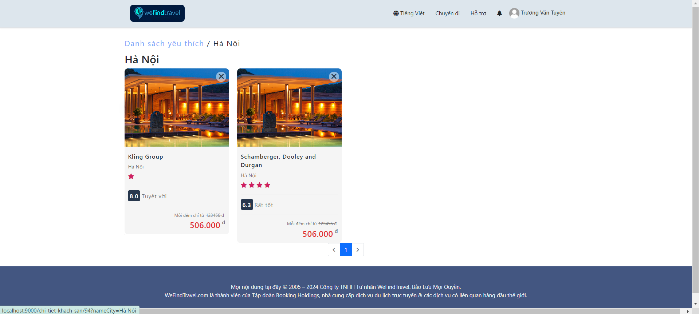
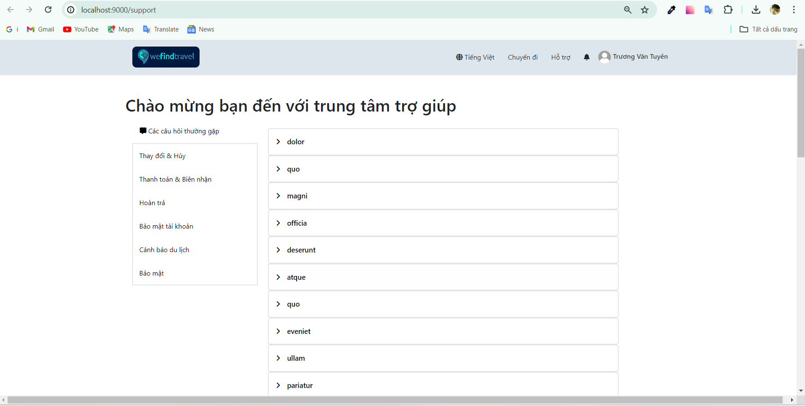

# Booking Hotel

##  Project Description
Hotel booking website project with features such as displaying famous and newest hotels, allowing users to book rooms and rate hotels. The admin interface allows administrators to manage website content, including adding, editing, and deleting hotels, managing users, and viewing reports
##  Basic Function For User
1. **Login/Sign up**:

2. **Home Page**
   - 
3. **Hotel Search**:
     - Users can search for hotels by city, date of stay, number of people and number of rooms as required.
4. **Hotel List**:
     - Users can filter hotels by amenities, reviews, stars, ..... Sort hotels by price, star rating, reviews.
     - 
5. **View Hotel Information**:
     - View information about the hotel's name, address, reviews, amenities, room list, and policies.
       
     - List of room and information .
       
     - Review of the hotel and policy.
         
6. **Booking**:  
  - Users fill in the necessary information to book a hotel room..
  -  
7. **Profile** :
     - Users can update their avatar as well as basic information for their account.
        
8. **Register for room rental**
   - Form Register
      
9. **My Booking**:
     - Booking list
       
     - View details of the booking you have booked, can cancel as well as evaluate with each different status.
      
10. **List of favorite hotels**:
    
11. **Support**:
   - Users can view support articles to use functions on the website
    
12. **Logout**:
##  Basic Function For Admin
1. **View System Overview**:
    - Admins can view a dashboard that provides a comprehensive view of important system metrics, such as the number of new registered users, the number of bookings for the month. This helps administrators grasp 
      the operating situation.
