# Booking Hotel

##  Project Description
Hotel booking website project with features such as displaying famous and newest hotels, allowing users to book rooms and rate hotels. The admin interface allows administrators to manage website content, including adding, editing, and deleting hotels, managing users, and viewing reports
##  Basic Function For User
1. **Login/Sign up**:
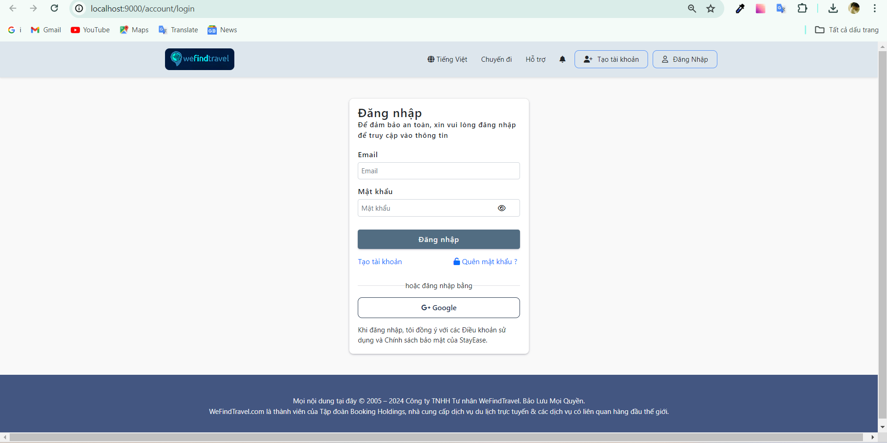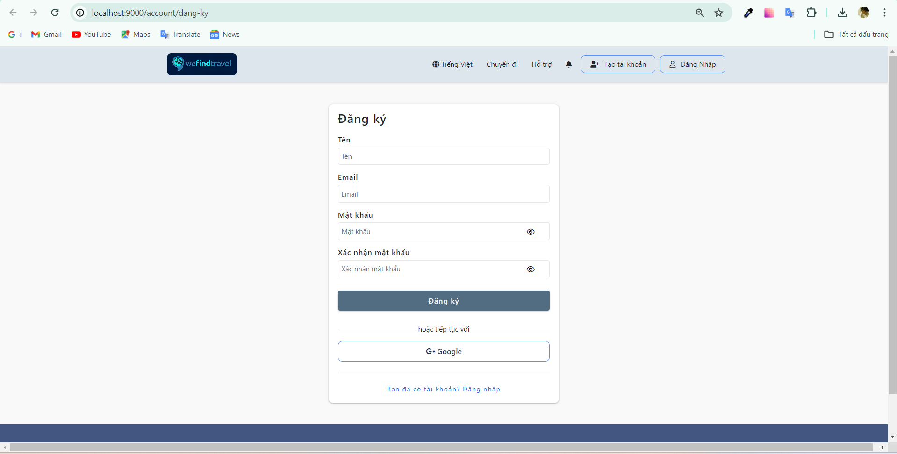
2. **Home Page**
   - 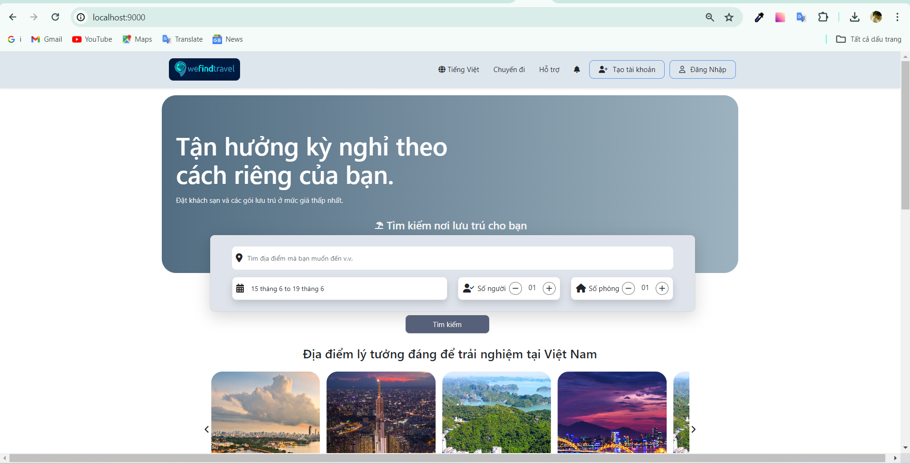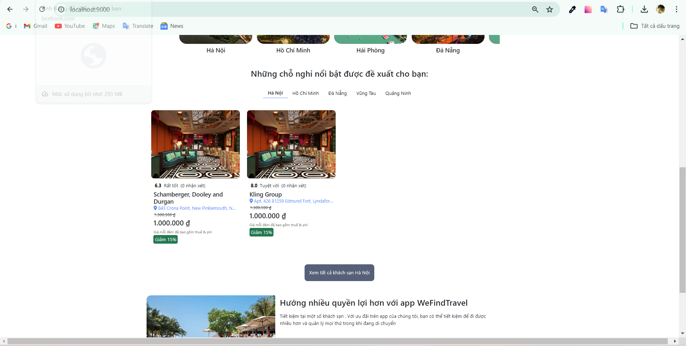
3. **Hotel Search**:
     - Users can search for hotels by city, date of stay, number of people and number of rooms as required.
4. **Hotel List**:
     - Users can filter hotels by amenities, reviews, stars, ..... Sort hotels by price, star rating, reviews.
     - 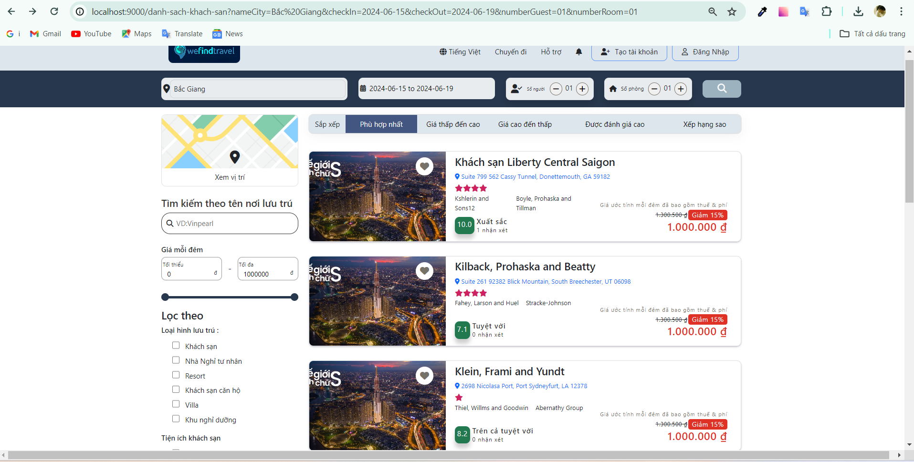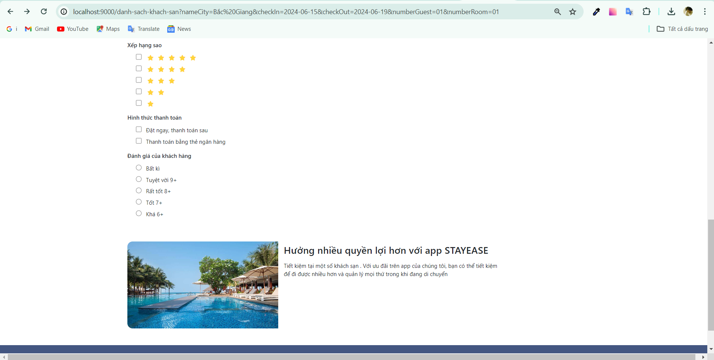
5. **View Hotel Information**:
     - View information about the hotel's name, address, reviews, amenities, room list, and policies.
       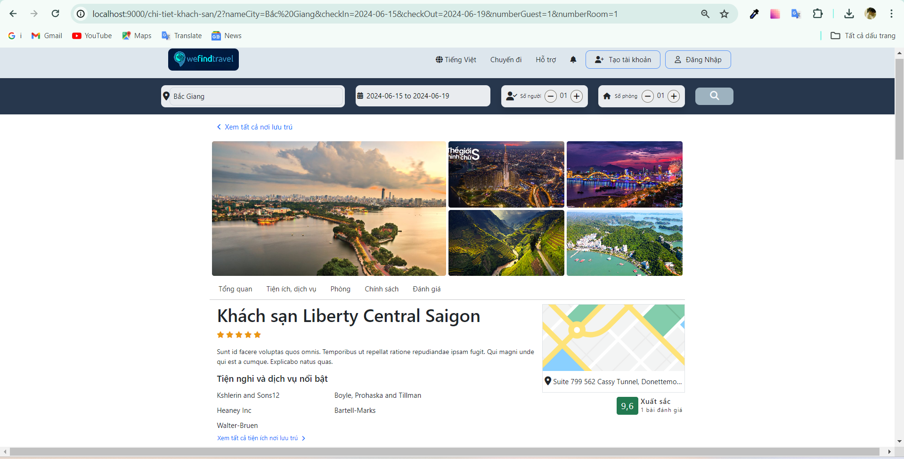
     - List of room and information .
       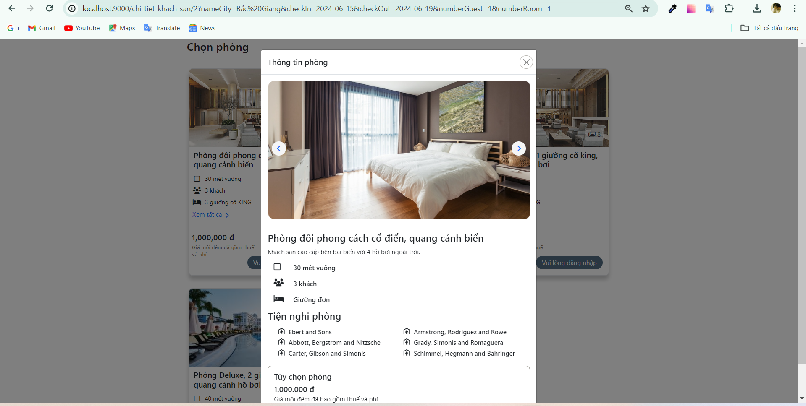
     - Review of the hotel and policy.
         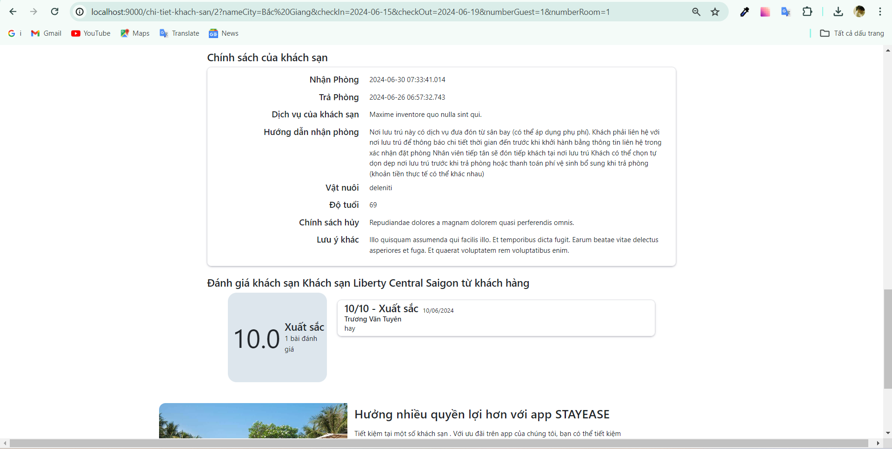
6. **Booking**:  
  - Users fill in the necessary information to book a hotel room..
  -  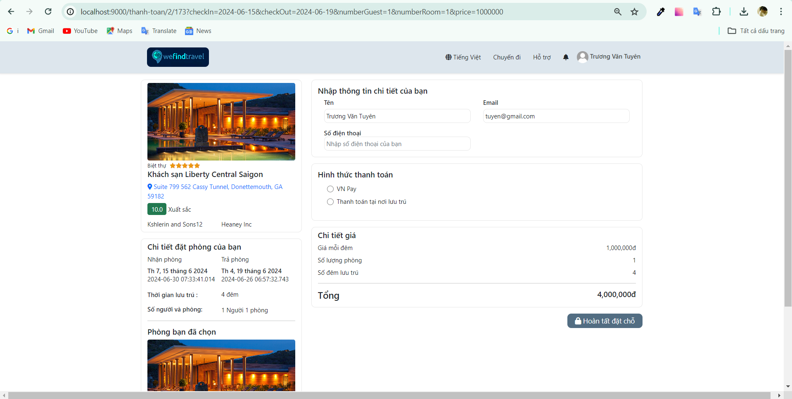
7. **Profile** :
     - Users can update their avatar as well as basic information for their account.
        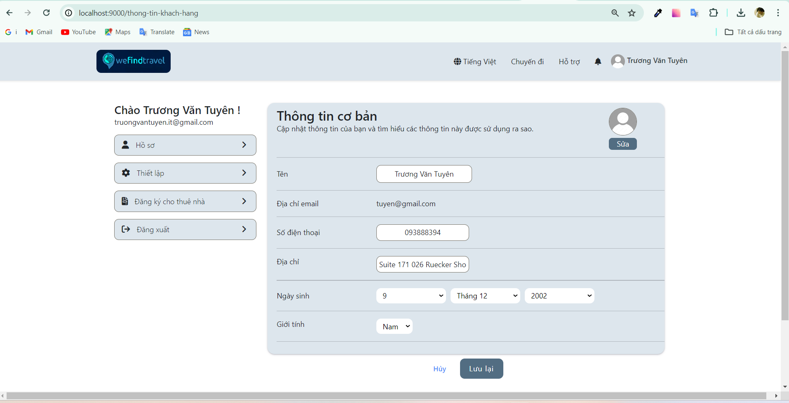
8. **Register for room rental**
   - Form Register
      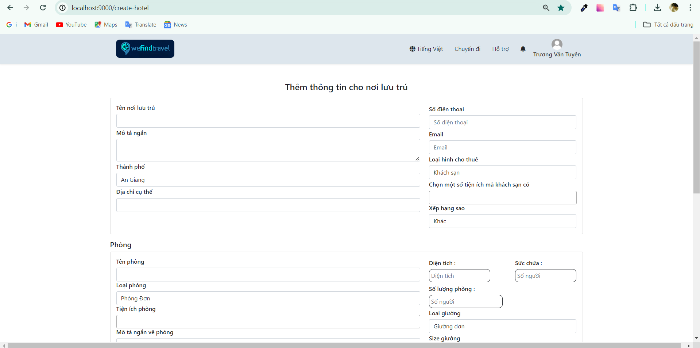
9. **My Booking**:
     - Booking list
       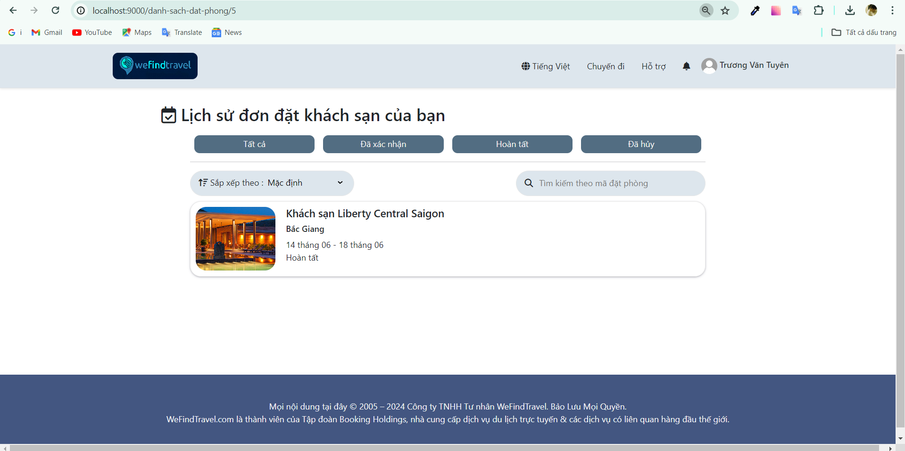
     - View details of the booking you have booked, can cancel as well as evaluate with each different status.
      
     
9. **Logout**:
9. **Logout**:
9. **Logout**:
9. **Logout**:
9. **Logout**:
##  Basic Function For Admin
1. **View System Overview**:
    - Admins can view an overview dashboard that provides a comprehensive view of important system metrics such as number of new registered users, number of most viewed movies, and more. This helps administrators       grasp the operating situation.
       
2. **Managing Movies, Episodes**:
    - This function allows administrators to add, edit or delete movies and episodes. Administrators can update movie information, manage movie status (eg: premiere, currently running, ended), and manage the           content of each episode.
      - Movie Management
        
       - Creeate Movies
        
       - movie Detail Role Admin
        
3. **Blog management**:
   - This function allows administrators to post, edit or delete articles about movie news, movie reviews or user guide articles. This is an effective way to interact and retain users on the system.
     - Blog Management
     
     - Create Blog
     
4. **Upload Image**
   
